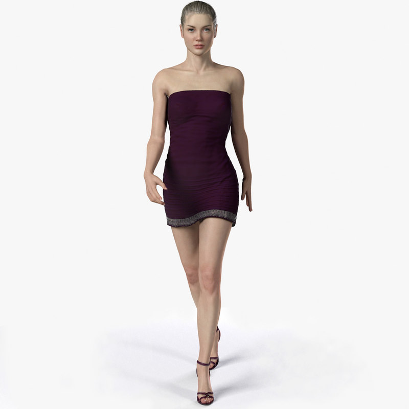

# VougeOn-Virtual-TryON
Virtual TryOn System

# Submission by Team NEXUS for TetraFlip
Entry of NEXUS, from SRM Institute of Science and Technology, Kattankulathur, to TetraFlip.

Open Innovation: An open-ended theme where the only restriction is your imagination. Build the ideas that you believe in and make a difference. It can either be hardware or software.


## Our Inspirarion
The whole revolution that this pandemic brought upon our lives has only sped up the process of every business going online. In such times, where e-commerce and e-shopping sites were already booming, having no choice but take to online shops has somewhere changed the user experience dynamics. Decision making is tougher in certain areas,  a major one being fashion.<br>
Choosing apparels and accessories by looking at them on models only pose a limited imagination, and thus the whole tedious process ordering and returning becomes a task in itself for both customers and brands. Hence, we thought of bringing the experience of offline shopping to the customers at home by using virtual reality and AI.


Our Approach : Amidst the raging world COVID 19 pandemic, the world is adapting so many new ways. Everything has pakced its parcel and moved online. So has shopping. So why not do it right?

## Requirements
Python 3.8 or above with all [requirements](requirements.txt) dependencies installed. To install run:
```python
$ pip install -r requirements.txt
```
## How to Run :
1. Test your Camera before heading towards main website. Run **Camera.py** file and test your Camera.
2. Now you can the main Website by heading toward **main.py** file. Simply run the file in any Code Editor (VS Code, Py Charm, etc..)

```python
$ python main.py
```
3. Chnage the code of **self.video = cv2.VideoCapture(1)** to **self.video = cv2.VideoCapture(0)**, if you want to use PC webcam, we have used Mobile Camera as Canera because of High Quality Cameras.<br>
   Software Used to Connect Phone Camera to PC : DroidCam (available on Play Store and https://www.dev47apps.com/droidcam/windows/)
   


<h2 align= "left"><b>Our Product</b></h2>

We NEXUS present before you,<b>"VougeOn - Virtual TryOn"</b>.

# WHAT YOU WILL EXPERIECNE ?
  For brands, a virtual try-on can make a significant difference when it comes to marketing and sales.
  
  A virtual try-on offers customers a realistic, personalized product presentation in seconds.

<h2 align= "left"><b>Website in a Print view</b></h2>

<p align="left">

 &ensp;
 &ensp;
 &ensp;
 &ensp;
 &ensp;
 &ensp;


## Presentation
Check the Documentation section for Video and PPT


## Tech Stack

- eJS,CSS,Bootstrap

- ALAN AI Speech recognition API

- Firebase Authentication.

 ## Models we used for Testing, you can try it on your own too just pan the camera towards you :
 
 ## Accessories Model
 
 
 
 ## Frocks Model
 
 
 
 ## Tops Model
 
